# Chunky Brains

### Building Digital Solutions That Drive Business Growth

Chunky Brains is a full-service IT company helping startups, businesses, and enterprises transform ideas into powerful digital products. Since 2017, we have been delivering high-quality web development, mobile app development, UI/UX design, SEO, and digital marketing solutions for clients worldwide.

We combine technology, creativity, and business strategy to create scalable solutions that improve user experience, automate operations, and accelerate growth.

---

## Industries We Serve

### AI & Automation

## Tatkal Doctor – WhatsApp Appointment Automation Platform

**Website Url:** https://www.tatkaldoctor.com/

**Project Overview**

Tatkal Doctor is a healthcare appointment automation platform that leverages WhatsApp to simplify patient appointment scheduling. Each healthcare provider receives a unique QR code that patients can scan to instantly access booking, rescheduling, and appointment management services.

**Key Features**

* WhatsApp-based appointment booking
* Unique QR code generation for doctors
* Doctor management dashboard
* Appointment scheduling and tracking
* Reschedule and cancellation management
* Patient interaction monitoring
* SMS package management system
* Administrative control panel
* Mobile-friendly user experience

**Business Impact**

The platform reduced administrative workload for healthcare providers while providing patients with a familiar and convenient communication channel for managing appointments.

**Screenshots**

<table align="center">
<tr>
<td valign="top">
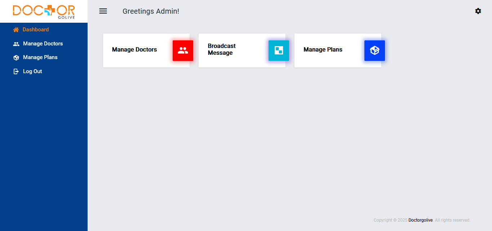
</td>
<td valign="top">
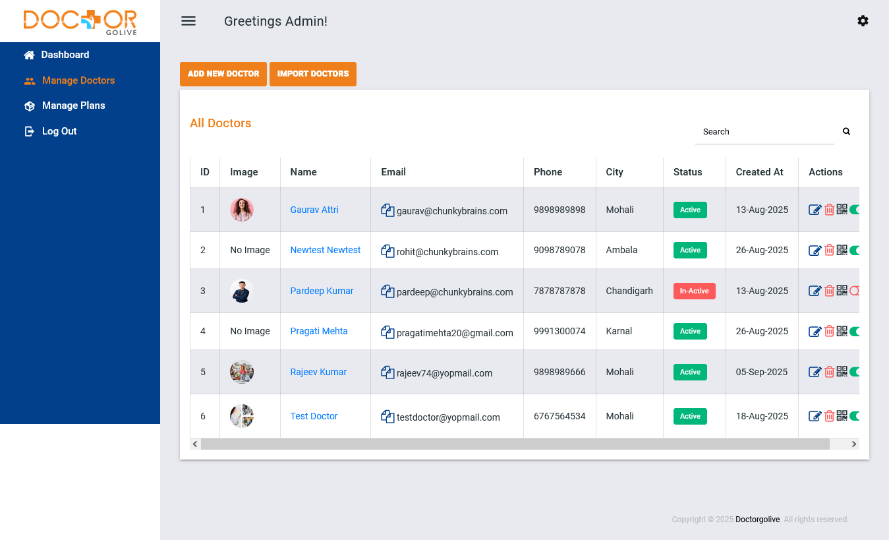
</td>
</tr>
<tr>
<td valign="top">
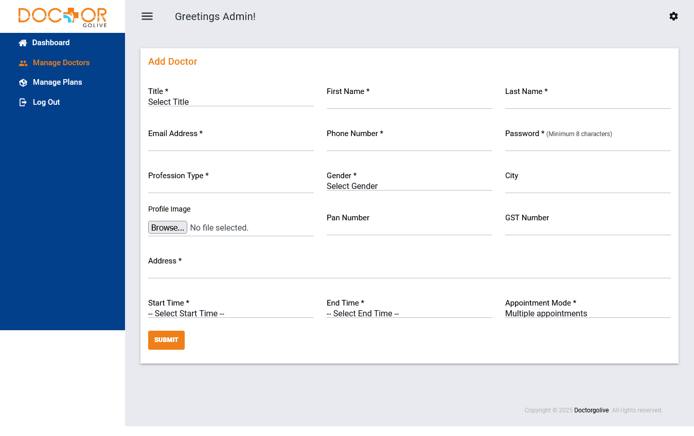
</td>
<td valign="top">
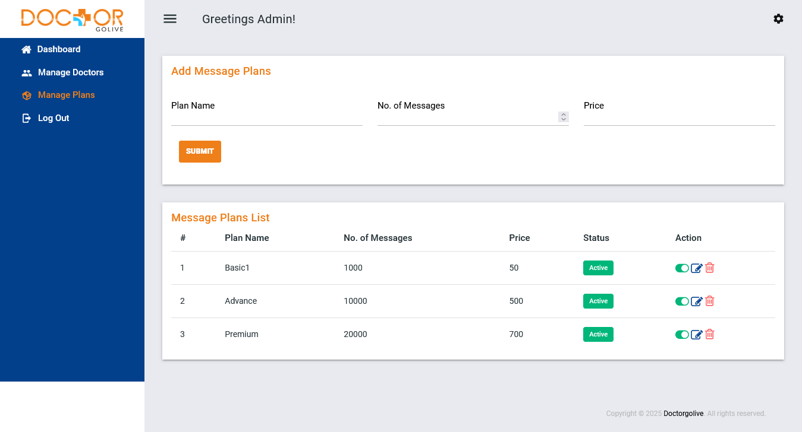
</td>
</tr>
<tr>
<td valign="top">

</td>
<td valign="top">

</td>
</tr>
</table>

## Cartha AI  *(Flutter)*
AI-powered emotional wellness companion helping users navigate anxiety, relationships, self-growth, and mental wellbeing.

### Downloads
* Android: https://play.google.com/store/apps/details?id=com.cartha_ai_mobile
* iOS: https://apps.apple.com/us/app/cartha-ai/id6737981702

### Screenshots

<table align="center">
<tr>
<td valign="top">
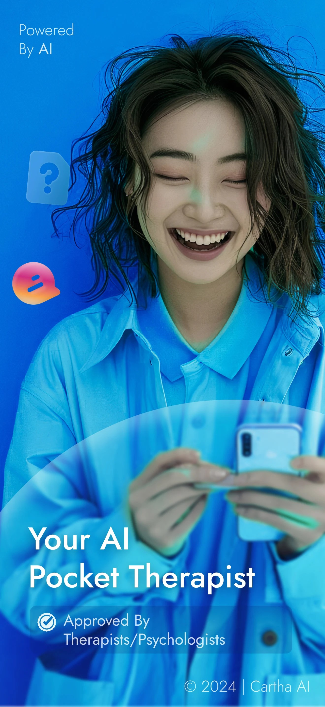
</td>
<td valign="top">
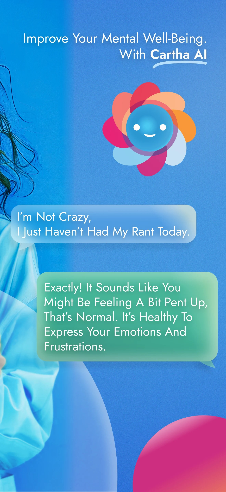
</td>
<td valign="top">
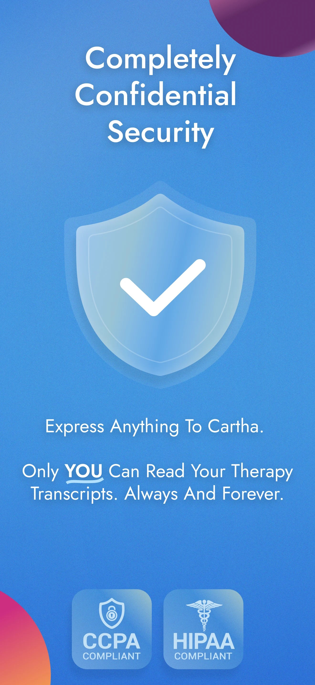
</td>
</tr>
<tr>
<td valign="top">
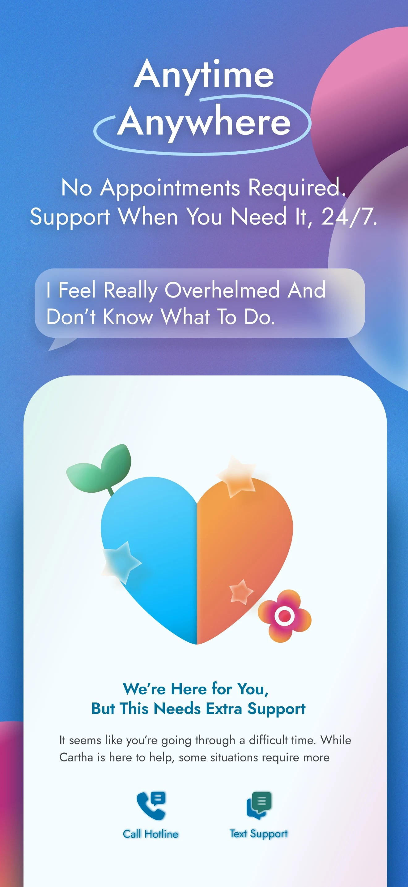
</td>
<td valign="top">

</td>
<td valign="top">
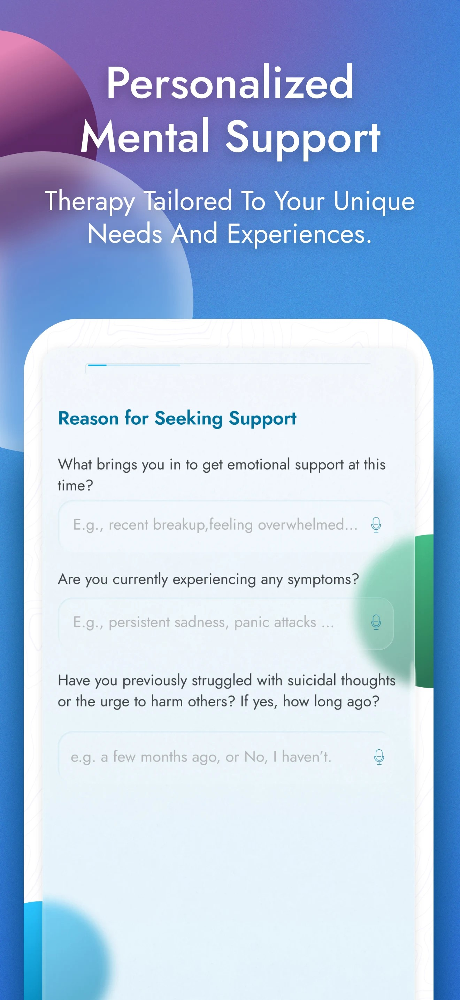
</td>
</tr>
</table>

### Management Solutions

### EMG – Facility Management

**Website Url:** https://admin.emgindia.in/

**Project Overview**

EMG is a comprehensive facility management platform designed for organizations providing security and cleaning services across commercial buildings, hospitals, offices, and industrial facilities. The system digitizes workforce operations, attendance tracking, incident management, and service reporting through both web and mobile applications.

**Key Features**

* Multi-level role-based access control
* Admin dashboard for workforce and task management
* Client portal for service monitoring and reporting
* Mobile applications for security guards and cleaning staff
* Geo-location based attendance tracking
* QR code verification for task completion
* Incident reporting with image uploads
* Real-time activity monitoring and reporting
* Image-based proof of work validation

**Business Impact**

The platform significantly reduced manual processes, improved operational transparency, enhanced workforce accountability, and streamlined communication between clients and service providers.

**Screenshots**

<table align="center">
<tr>
<td valign="top">
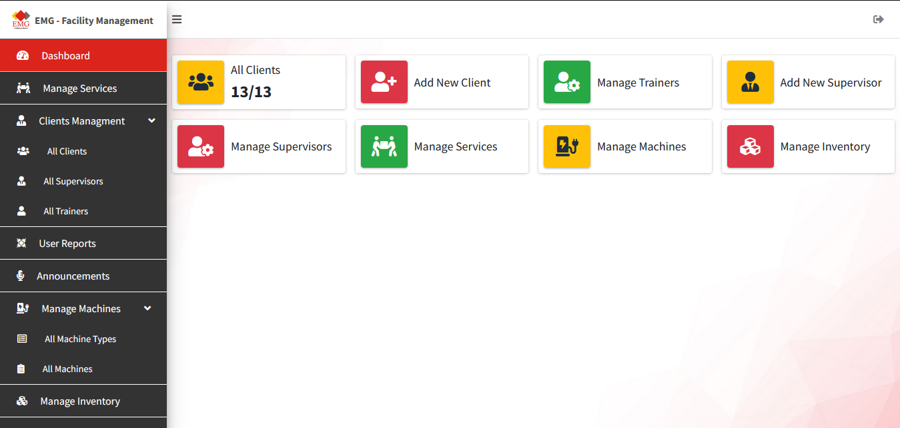
</td>
<td valign="top">
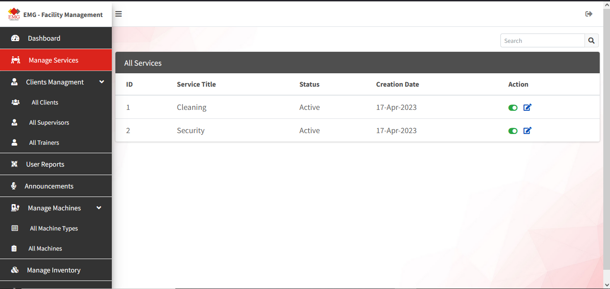
</td>
</tr>
<tr>
<td valign="top">

</td>
<td valign="top">
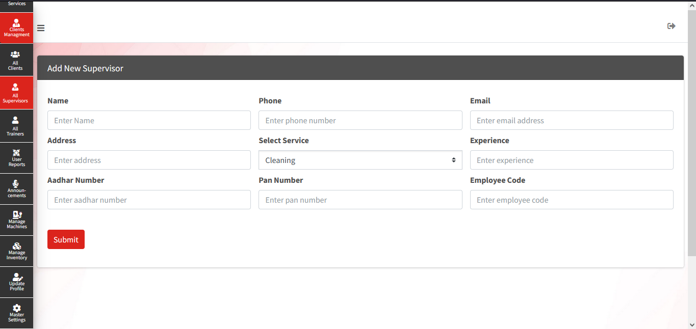
</td>
</tr>
<tr>
<td valign="top">

</td>
<td valign="top">

</td>
</tr>
<tr>
<td valign="top">

</td>
<td valign="top">

</td>
</tr>
</table>

## ANRML  *(Flutter)*
Industrial CMMS platform for maintenance scheduling, asset tracking, KPI monitoring, and operational workflow optimization.

### Downloads
* Android: https://play.google.com/store/apps/details?id=com.anrml

### Screenshots
<table align="center">
<tr>
<td valign="top">
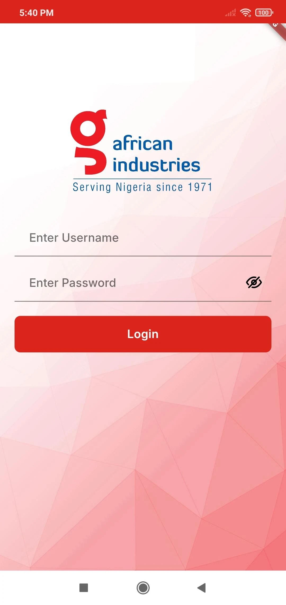
</td>
<td valign="top">
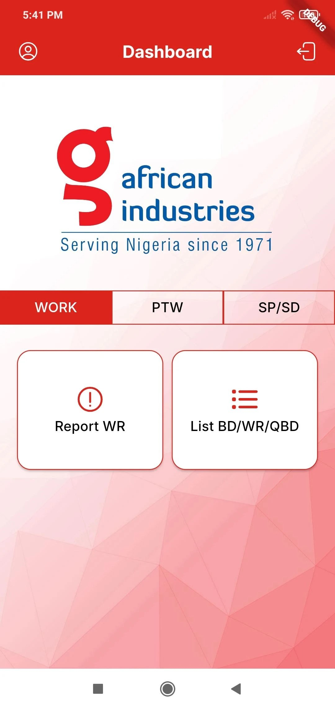
</td>
<td valign="top">
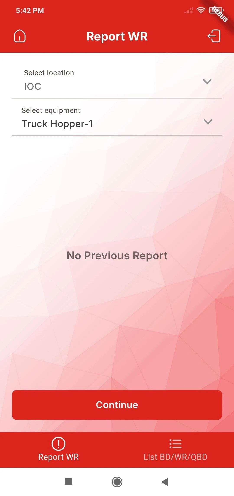
</td>
</tr>
<tr>
<td valign="top">
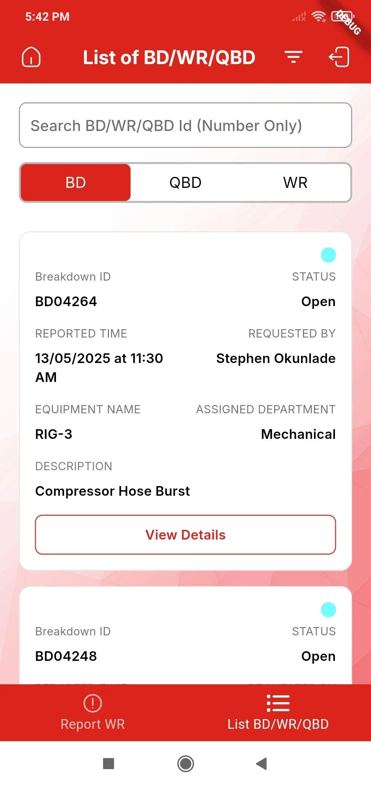
</td>
<td valign="top">
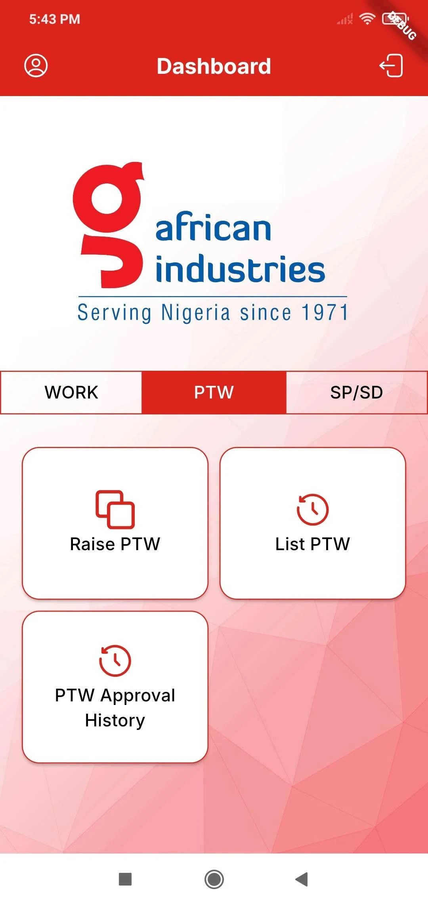
</td>
<td valign="top">
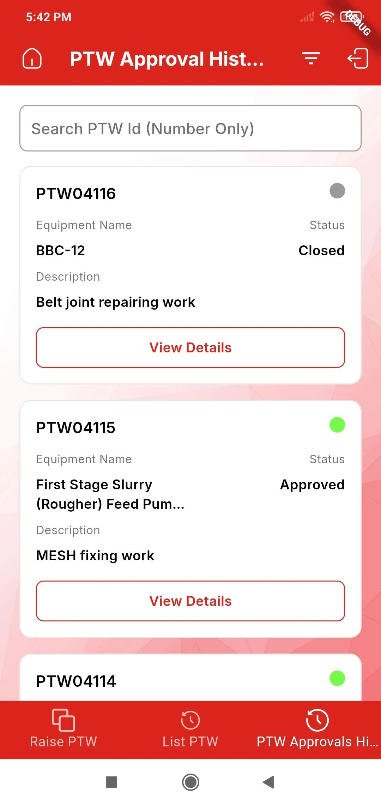
</td>
</tr>
</table>

---

## What We Do

* Custom Website Development
* Web Application Development
* Laravel & PHP Development
* WordPress Development
* E-Commerce Solutions
* Android App Development
* iOS App Development
* Flutter App Development
* UI/UX Design
* API Integrations
* SEO Optimization
* Digital Marketing
* Website Maintenance & Support

---

## Technologies We Work With

* Laravel
* PHP
* Flutter
* Android
* iOS
* JavaScript
* MySQL
* HTML5
* CSS3
* Bootstrap
* WordPress
* Git & GitHub
* REST APIs

---

## Portfolio Repositories

### Website Development Portfolio

https://github.com/brainschunky/ChunkyBrains-Websites-Work

Collection of web development projects including Laravel applications, WordPress websites, e-commerce platforms, business portals, custom web solutions, and third-party API integrations.

### Mobile Applications Portfolio

https://github.com/brainschunky/ChunkyBrains-Mobile-Apps

Mobile application projects built for Android, iOS, and Flutter platforms, focusing on performance, scalability, and exceptional user experience.

### Laravel Code Samples

https://github.com/brainschunky/Laravel-Code-Samples

Production-grade Laravel patterns covering service layer architecture, repository pattern, JWT & Sanctum authentication, REST API development, queue jobs, event-driven architecture, payment gateway integration, and more.

### Mobile Architecture Code Samples

https://github.com/brainschunky/Mobile-Architecture-Code-Samples

Code samples and architectural patterns from our mobile development work across Flutter, Android, and iOS — covering state management, API integration, offline handling, and scalable project structure.

---

## Why Choose Chunky Brains

* 8+ Years of Industry Experience
* End-to-End Development Services
* SEO-Friendly Development Approach
* Modern & Scalable Architecture
* Client-Centric Development Process
* Long-Term Support & Maintenance
* Global Client Base
* Transparent Communication

---

## Our Mission

To empower businesses with innovative technology solutions that simplify processes, enhance customer experiences, and create sustainable growth through digital transformation.

---

## Let's Build Something Amazing

Whether you're launching a startup, scaling a business, or modernizing an existing platform, our team is ready to help transform your vision into reality.

Website: https://www.chunkybrains.com

Contact: chunkybrains123@gmail.com

---

### Turning Ideas Into Digital Success Stories

